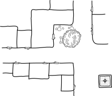
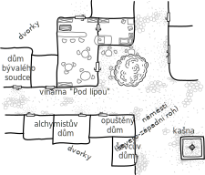
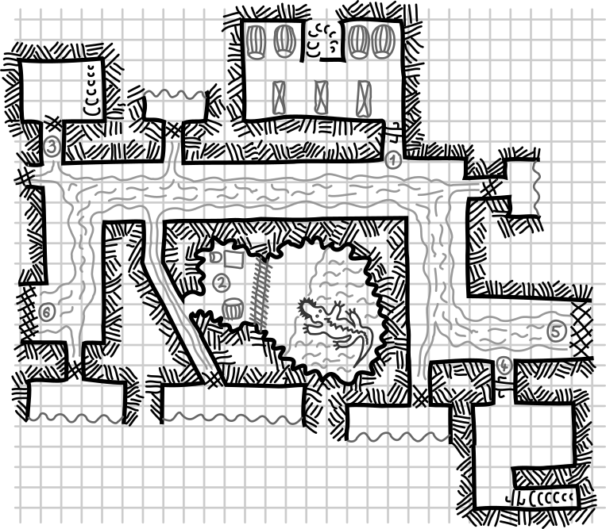

=============
Duha ve městě
=============

Dobrodružství je zamýšleno pro skupinku 3 dobrodruhů na první úrovni. Co se pravidel týče a způsobu popisu příšer či předmětů, vycházíme z prastarého Dračího doupěte. Myslím ale, že to půjde převést na libovolný systém.

Myšlenka zápletky pochází z modulu DrD Taria – Pohraničí, ale je velmi a velmi zjednodušeno, zestručněno a převyprávěno do podoby hratelné dětmi.

Odstavečky uvozené textem "Popis pro hráče:" je bezpečné hráčům přímo přečíst. Zbytek slouží jen potřebám vypravěče. Popisy pro hráče neobsahují přesný popis tvaru místnosti a toho jaké dveře z ní vedou - předpokládá se, že to doplní vypravěč vlastními slovy podle přiložených mapek.

Jakožto vypravěč si text předem prolítni ať víš do čeho jdete a pak můžete začít hrát.

Shrnutí
=======

V malém městě si družinku vyhledá místní rychtář a požádá je o pomoc s problémem se kterým si podle svých slov prý už dlouho láme hlavu. Ve městě někdo vyrábí (vaří) droga "Duha" a mu se varnu nedaří vypátrat.

Ve městě se o gangu vařícím Duhu tak nějak ví, jen nikdo neví nic určitého. Ví se o tom že se nevyplatí moc jim lézt do zelí. Nedávno to prý zkoušel místní soudce, ale pak zmizel. Jen v jeho domě se našla obrovská krvavá skvrna. Něco ho prý sežralo.

Družinka začne pátrat a třeba sledováním nějakého "závisláka" zjistí že droga se prodává ve vinárně na rohu místního náměstí. Dalším sledováním zjistí že prodejce si pro každou prodanou dávku chodí do sklepa. Tam se tedy vydají dál.

Ve sklepě možná objeví prodejcovu zásobárnu a dvířka kterými je doplňovaná. Dvířka vedou do nebezpečného podzemí, městské stoky. Tam bude potřeba trochu pátrat.

Je možné narazit na nedávno upilovanou mříž se vstupem do bývalého soudcova domu, nebo místo kde gang vězní hrozivou příšeru která se soudcem nakrmila. Družinka se ji možné pokusí zabít, nebude to ale nic jednoduchého.

Snad také najdou mřížová dvířka s promazanými panty do domu alchymistky která drogu "vaří" a hned vedle vstup do opuštěného domu využívaného jako varna.

Po nahlášení svého nálezu rychtáři, je čeká nemilé překvapení. Když po různých zdrženích do domu rychtář vtrhne, nic se tam nenajde. Ve skutečnosti je totiž právě rychtář hlavou zločineckého gangu a tak se ujistil, že varna bude vyklizena před zátahem městské stráže.

Rychtář skupinku najal na naléhání městské rady, která ho dlouhodobě kritizovala pro pomalý postup v tomto případě. Doufal, že pár nezkušených a snad i neschopných dobrodruhů s případem nic nesvede a gang získá další čas pro nerušenou práci.

S trochou štěstí se ale v družince mýlil a a ti neodtáhnou s prázdnou. Dojde jim jak to bylo, možná s nápovědou nějakého strážného nespokojeného s tím jak to na strážnici chodí. Potom se obrátí na městskou radu a celý příběh skončí uvězněním padouchů a odměněním hrdinů.

Zadání úkolu
============

Družinku kolem poledne vyhledá úlisný rychtář, velitel městské stráže a požádá je o nenápadnou pomoc.

.. epigraph::

   **Rychtář** byl v období středověku představeným městské či vesnické obce (obdoba dnešního starosty). Ve středověku rychtář mohl být do své funkce buď dosazen vrchností, resp. panovníkem, obec si mohla vlastního rychtáře volit nebo se mohlo jednat o pozici děděnou v jednom rodě. Mezi povinnosti a práva rychtáře patřilo nižší soudnictví ve městě či vesnici, správní funkce, zastupoval obec vůči okolí a často také byl reprezentantem vrchnosti a ručil jí za dodržování povinností a příkazů a vybírání daní, poplatků a úroků.

   -- `Wikipedia: Rychtář <https://cs.wikipedia.org/wiki/Rycht%C3%A1%C5%99>`_

.. admonition:: Popis pro hráče:

   Postáváte v malém obchůdku na náměstí. Venkovní vývěska jako název obchodu uvádí "Havraní pera a zahnutá pátá klika" s nápisem na dveřích "Odborník na obchod s věcmi, které si myslíte že nepotřebujete, ale věřte nám, potřebujete je". Zatímco si prohlížíte zboží, probíráte staré knihy a zkoumáte podivné artefakty, do místnosti vstoupí rychtář.

   Když na vás promluví, obracíte se k němu s lehkým překvapením. Rozhodně jste nečekali že by s o vás mohl zajímat sám rychtář. "Mám pro vás nabídku, která by vás mohla zajímat. Slyšel jsem o vašich schopnostech a odvaze." říká rychtář. Zdálo se vám jako by jeho pohledem nakrátko projelo pobavení, ale to jste asi špatně viděli, protže hned pokračuje stejně vážným tónem jako předtím. "Jakýsi temný vliv působí na mé město. Rozmohli se nám tu nebezpečné drogy zvané Duha. Na původce táto zhouby jsou mé stráže krátké a právě proto potřebuji nezávislou pomoc."

   Nakloní se blíže a ztiší hlas: "Neočekávám od vás že se sami postavíte celému gangu. Co od vás chci je, abyste odhalili místo kde se Duha prodává a místo kde ji vyrábí. Chápu že takové věci mohou být nebezpečné. Vaším úkolem je jen zjistit informace které našim strážím umožní ten gang zlikvidovat."

   "A jak by to bylo s odměnou?" zeptáte se.

   Na chvíli vypadal jako by ho vaše otázka překvapila, ale pak pokrčí ramena a povídá: "Peněžní odměna je prostředek, jak vám vyjádřit naši vděčnost za vaši odvážnou pomoc. Až mi informace přinesete, můžete se spolehnout na to že budete spravedlivě odměněni za vaše úsilí. Co takhle 100 zlatých?"

Pátrání
=======

Družinka se snad pokusí získat nějaké informace či stopy, které ji přiblíží nalezení varny. Předpokládám že nejdřív se budou dost vyptávat a nejvíc lidí se "v tuto hodinu" dá potkat na náměstí. Tady je slepá mapa kterou je bezpečné ukázat hráčům:

Pokud se pokusí získat informace o droze samotné:

.. admonition:: Popis pro hráče:

   Děda kterého jste oslovili se na vás zkoumavě podívá. Přece jen o těchhle věcech se člověk s cizinci jen tak nebaví, ale asi usoudil že od vás mu žádné nebezpečí nehrozí, a tak začal: "Nó, to já když byl malej kluk, tak tyhle věci vůbec nebejvaly. Občas se někdo opil, to zase jo a to bych mohl povídat, ale to je něco úplně jinýho. Tahle Duha, jak jí říkají, si člověka úplně připoutá. Viděl jsem uplně zdravý kluky co to zkusili jednou, možná dvakrát a ta duha se pro ně naráz stala nejdůležitější věcí na světě. Takoví se potom akorát starají o to kde vzít peníze na další dávku. Jen málo komu se podaří s tím přestat. Většinou se jen rozhádají s rodinou, s těma jedinýma kdo by jim mohli pomoct".
   "A jaké má vlastně ta Duha účinky?" přerušíte staříka otázkou.

   Ten vypadá potěšeně že ho pořád posloucháte a tak pokračuje: "No slyšel sem, že to je jako by se člověk vznášel, jako by prý prolétal duhou a že u toho prý zapomene na všechny problémy. Tohle trvá pár hodin. Takovýho člověka poznáte tak že sedí a kouká do blba. No ale pak začne střízlivět. Ze začátku se nic hroznýho neděje, ale viděl jsem chlapy co to berou pár měsíců a ty pak najdete jak zvrací v příkopě nebo se drží za hlavu a vyjou bolestí. Čím dýl to bereš, tím horší. No ale tohle je takový blbý téma, nechcete rači slyšet o tom jak jednou švec vykoupal cestou na trh pytel nových škorní v rybníce? To bylo tak..."

   Děda se zřejmě chystá vyprávět o něčem dalčím, takže ho rychle stopnete: "My už vlastně nutně potřebujeme jít, děkujeme dědečku". Odcházíte ale s lepší představou o droze.

Možná zastaví nějakou dobře oblečenou měšťanku, která jim trošku objasní pozadí toho jak dosud probíhalo pátrání:

.. admonition:: Popis pro hráče:

   "No já normálně drby neroznáším, taková já nejsem" vykrucuje se nejdřív měšťanka kterou jste zastavili a zeptali se jí jak je to tady ve městě s rychtářem a jeho pátráním po zdroji Duhy, "ale možná, čistě z dobrého srdce bych vám mohla říct jak to tady chodí. Jen pro vaše dobro, samozřejmě, abyste nespadli do nějakého maléru, že ano."

   "S tím hnusem to tu myslím začalo tak před pěti lety. Tehdy tu byl rychtář teprve chvíli. Předchozí rychtář odešel na odpočinek a náš kníže sem přivedl nového. Asi nečekal že bude muset hned řešit takovýhle problém. Rychtář se do toho pustil jako drak, ale až do teď nic pořádně nevypátral. Občas sebere pár chudáků co jsou na tom závislí, ale to nic neřeší".

   Opatrně se rozhládla kolem: "Nedávno ale radě konšelů došla s rychtářem trpělivost a začali vyhrožovat, že knížete požádají o jiného rychtáře, nějakého který si s tím sviňstvem poradí". Ztišila hlas jak to jen šlo a pokračovala: "Prý se před týdnem na zasedání strašně pohádali, řekli mu že je nekňuba. To se povedlo, protože na celé radnici trošku chytrosti abys pohledam. No ale prý mu dali ultimátum. Prý to má do měsíce vyřešit, nebo jsou za knížetem."

   "A to se rychtáří vážně nikdy nic nepovedlo?" zeptáte se. "No vlastně ano, i když nevím jestli to byla rychtářova zásluha. Městská hlídka jenou zathla nějaké měšťany a pár pobudů. Byli podezřelí z toho že jsou do toho zapletení, pak se stalo tam to našemu soudci a nebyl kdo by je soudil, tak je museli propustit."

   "Počkejte, co se stalo soudci?" taháte z ní další informace. "No to bylo tehdy strašně divné. Večer odešel z hospody kam chodil na večeři. Jeden z hlídky co mu svítin na cestu říkal že doma se zamkl, ale ráno ho našli rozsápaného přímo v jeho pokoji. Prosťe hrůza". Zamyšleně pokývala hlavou, ale pak vyjekla: "Jejda, já se tady vykecávám a zatím mi zavřou u řezníka. Musím už jít!" Zamávala a v mžiku byla pryč.

Kladďák z městské hlídky:

Závislák:

Vinárna pod lípou
=================

Družinka se pokusí zjistit jak se Duha prodává a následně se pokusí proklouznout do sklepa.

Popis vynárny

Pokud bude družinka sledovat někoho kdo vypadá jako typický uživatel Duhy, dovede je až do vinárny. Tam můžou být svědky toho, jak se Duha prodává.

**Akce**

* Nenápadné sledování závysláka bude poměrně jednoduchá past na *CHAR 3: všiml si vás a utekl/nenápadně ho sledujete*.

  .. admonition:: Popis pro hráče:

     Nenápadně jste postávali ve vinárně a předstírali že dumáte o tom kterou z vystavených lahví koupit. U toho jste po očku sledovali jak se závislý otrapa blíží k pokladně. Byl to mladý muž, oblečený v roztrhaných šatech a říct že měl "zanedbaný vzhledem" by mu příliš fandilo. Zastavil se před prodavačem. Oči měl červené a byly jasně vidět nateklé žíly na krku.

     Prodavač, vousatý muž v kožených kalhotách, se na něj jakoby vítězoslavně usmál. Jistě věděl co příjde. "Co pro tebe mohu udělat?"

     Muž vytáhl z kapsy pět stříbrňáků. "Duha," řekl tichým hlasem a s prosebným pohledem je třesoucí se rukou je podával prdavači. "Prosím!"

     Prodavač se ušklíbl a vzal si peníze. Pak se shýbl, otevřel velký poklop za barem a vešel dovnitř. Za okamžik se vrátil s něčím malým schovaným v dlani. Nedbale se rozhlédl kolem, jestli je někdo nepozoruje. Naštěstí jste to tušili a aspoň na tu chvíli na ně nezírali. Prodavač si byl ale zřejmě dost jistý tím že mu nic nehrozí. Potom svému zákazníkovy předal malou papírovou obálku.

     Muž obálku rychle otevřel a na dlaň z ní odsypal několik fialových krystalů. Bez zaváhání, velmi nedočkavě je slízl a jeho oči se rozzářily a na tváři se mu rozšířil úsměv.

     Pak už jste viděli jen jeho záda jak mizí na rušné ulici před vinárnou.

Akce na proplížení se do sklepa

Sklep vinárny
=============

.. admonition:: Popis pro hráče:

   Malý sklep s čtyřmi mohutnými sudy a několika poloprázdnými policemi s lahvovými víny. Sudy jsou povalené na bok, zajištěné proti kutálení a ve spodní části mají kohoutek pro napouštění vína do džbánu.

① Točité schodiště
------------------

Točité schody vedoucí z vinárny se stáčí dolů. Dveře které je dole oddělují od sklepa jsou kvůli teplotě zavřené.

**Akce**

* I když je vinař součástí gangu, bojí se netvora a na schody tak rozmístil několik prázdných lahví aby ho zvuk rozbíjeného skla při případném pohybu netvora upozornil na nebezpečí. Podaří se projít bez upozornění na sebe? *OBR 3: některá lahev se rozbíjí/tichý průchod*.

② Sud se skrýší
---------------

V tomto sudu není víno, ale zásoba pytlíčků s drogou Duha a měšec s tržbou pro gang.

**Akce**

* Pokud někdo bude prohledávat sklep, možná si všimne této tajné skrýše: *INT 6: nic/otevření tajné skrýše*.

  * Ve skrýši se najde 8 pytlíků s dávkou "Duhy" a měšec s 125 st.

③ Police
--------

Ve třech policích nejdete několik zaprášených lahvových vín.

④ Dvířka
--------

Tady jsou oplechovaná dvířka vedoucí do podzemí. Při otevření nekladou odpor a družinka si možná to že ani nevrzla spojí s tím že jsou namazaná a často používaná.

.. admonition:: Popis pro hráče:

   Otevíráte nízká pevná dvířka vystužená solidním plechem. Na žádné pavučiny jste nenarazili a dokonce se neozvalo ani očekávané zaskřípění pantů. Prostě to šlo bez jediného zádrhele. Jen předklonit se musíte a můžete projít.

Kanalizace
==========

Tato část městské kanalizace je jakési rozcestí našeho dobrodružství. Připojuje se do něj spousta velkých trubek pro odpadní vodu z domů, ale až na popsané výjimky se mříže žádné z nich nedá otevřít.

.. admonition:: Popis pro hráče:

   Do nosu vás udeřil koncentrovaný pach celáho města. Tři metry široká stoka, kterou teď, dlouho po nějakém větším dešti, protéká jen malý ale hustý potůček. Je asi metr široký, takže pokud vám nevadí se čas od času otřít o slizký kámen nebo si na hlavo nechat namotat hezkou pavučinu, můžete pohodlně, suchou nodou, chodit po obou stranách. Kromně občasného šplouchnutí nebo zabublání tu panuje úplné ticho.

① Sklep vinárny
---------------

**Akce**

* Pokud někoho napadne naslouchat, nic neuslyší, ale možná ho na tom něco trkne: *INT 8: nic/je ti podezřelé, že neslyšíš občasné zapištění krys*. Opravdu. V celé kanalizaci není vidět ani jedna.

② Netvorovo vězení
------------------

Tady gang chová netvora. Mladého, ale vražedného krokodýla.

.. admonition:: Popis pro hráče:

   Vstupujete do nahrubo vyhloubené jeskyně která je mříží rozdělena na dvě části. Ta menší, volně přístupná u vchodu je zařízena stolem se židlí a naproti pak stojí sud. V mříži jsou dveře zamčené visacím zámkem. Pokud se vám daří osvětlit část jeskyně za mříží, vidíte jen černou hladinu podzemního jezírka, hladkou jako sklo.

**Akce**

* Pokud se někdo rozhodne prozkoumat sud a otevře jeho víko, pak je to past na *ODO 6: zatočí se hlava a 10 min se musí vzpamatovávat/nic*. Sud je totiž plný starého masa, netvorovy potravy.
* K otevření dveří je možné se postavit dvěma způsoby. Jít na to silou, nebo rozumem, takže buď a nebo:

  * *SÍL 4/10: zranění za 1 živ při vyrážení/nic/vyražení*
  * *INT 4: nic/najdete klíč zavěšený na stěně*

* Pokud se družince podaří otevřít dveře a vejdou dovnitř, zaútočí na ně :ref:`netvor <Krokodýl, mladý>` (životy ▢▢▢▢▢▢▢▢▢▢▢, ÚČ: +3 (tlama) + možnost dlouhého zakousnutí/+2 (ocas) + možnost podražení nohou, OČ: +3, zkušenosti: 30)

③ Sklep soudcova domu
---------------------

Tato mřížová dvířka se dají pohodlně otevřít. Když soudce začal být pro gang nepříjemný, přepilovaly mříže a netvora na soudce vypustili. Zpět ho nalákali jak obvykle: hromádka pěkně odleželých vnitřností od místního řezníka hned za drátěným okem na konci dlouhé tyče. Drát kolem krku a pak s netvorem hurá zpátky za mříže.

.. admonition:: Popis pro hráče:

   Vstupujete do malého sklepa, do místnůstky kam vede jen odpadní trubka z vrchního patra a dveře.

**Akce**

* Pokud bude někdo vstupní mříž prohledávat, pak *INT 4: nic/všimne se čerstvě uřezané petlice kde asy býval zámek*.
* Pokud se družinka rozhodne prohledat sklepní místnost či schody, pak *INT 6: nic/najde ulomený dráp*. Je to dráp který si tady ulomil netvor, když tudy prolézal aby sežral soudce.

  .. admonition:: Popis pro hráče::

     Našli jste něco co vypadá jako ulomený dráp nějakého zvířete. Je leskle černý, zahnutý a proklatě ostrý. S jeho původním majitelem by jste se jistě setkali jen velmi neradi.

* Pokud družinka vystoupí po schodech, ocitne se v malém prázdném domě po soudci. Dveře na ulici jsou zamčené.

  .. admonition:: Popis pro hráče:

     Přišli jste do zcela prázdného, středně velkého domu. Dveře ven na ulici jsou zamčené, okna jsou zavřená okenicemi. Veškeré zařízení je pryč, nezbyl ani stůl. Jen uprostřed hlavní místnosti vidíte na jinak pečlivě drhnuté podlaze velkou černou skvrnu.

④ Sklep varny
-------------

Dveře ze stoky do sklepa i ze sklepa na schody nahoru do domu jsou odemčené. Přesto projít prázdným sklepem varny asi nebude tak jednoduché jak to vypadá. Alchymista který nahoře čas od času připravuje Duhu tu nachystal jedno překvapení pro všechny nezvané hosty - plyn který způsobí vystrašení těch co mu podlehnou. Členové gangu mají jednoduchý způsob jak projít. Odhalí i družinka že stačí chvíli nedýchat a proběhnout?

Hráčům neříkej že jde o halucinaci. Možná někdo z nich nepodlehne a přesvědčí ostatní aby to zkusili znovu? Možná příjdou na to nedýchání nebo použijí mokrý šátek přes obličej? Každopádně si asi budou muset vyjasnit nesrovnalosti v tom kdo co viděl a nějak to vymyslet. Past je totiž poměrně silná.

.. admonition:: Popis pro hráče:

   Otevíráte od pohledu pevné dveře vedoucí do dalšího sklepa napojeného na kanalizaci. Dveře jsou nové, naolejované, asi aby odolaly vlhkosti která tady dole panuje i v nejteplejších měsících.

**Akce**

* Pokud se pokusí (ještě zavřené) dveře někdo prozkoumat, pak je to past na *INT 4: nic/zpozorování kvality dveří, viz popisek níže*.

  .. admonition:: Popis pro hráče:

     Skvěle sedí ve svých futrech z na hrubo přitesaného zdiva. Někdo si dal záležet aby perfektně doléhaly, taková pečlivost se nevidí.

* Hned po vstupu do místnosti si každá postava musí hodit na past *ODO 8/10: zaůtočily na tebe zombie (viz popisek níže)/je ti velmi nevolno a vymotáš se zpět/cítíš divný smrad, jinak vše v pořádku*.

  .. admonition:: Popis pro hráče:

     V temnotě sklepa před vámi se rozsvítí dvě malá modrá světýlka a vás se začíná zmocňovat neklid. Ta světýlka se hýbou, přibližují se! Teď už rozeznáte o co jde. Jsou to oči nějakého kolébavě se pohybujícího člověka. Ach ne, další čtyři páry stejných světýlek a všechny se k vám přibližují. Slyšíte jak ty postavy šourají nohama. Teď už necítíte jen nějaký mírný neklid, ale potíte se a roztřásla se vám kolena.

     Postavy přišly blíž a už dokážete rozeznat podrobnsti. Šaty potrhané, mrtvolně šedá kůže, různé údy v různě nepřirozených pozicích, nepřítomný pohled a slintající ústa plná černých vyceněných zubů. Zmocnila se vás úplná panika který se nedá nijak ovládnout. Berete nohy na ramena a utíkáte odkud jste přišli. Pět zombií je vám v patách.

     Po pár krocích, zpět v kanalizaci se ti zdá že jsi je setřásl. Ještě teď se ale strachy potíš, ale s každým nádechem se pomalu uklidňuješ. Každopádně víš, že bez pořádného důvodu tě do toho sklepa už nic znovu nedostane.

* Každá postava si proti pasti háže pokaždé, když do místnosti vstoupí - tedy pokud nepříjde na to, jak se před plynem brání členové gangu: stačí si zacpat nos a při probíhání místností nedýchat. Toto družinka nevymyslí hodem proti nějaké pasti, musí to vymyslet sami.

⑤ Mříž pod kašnou
-----------------

Silná mříž zabraňuje družince pokračovat v průzkumu kanalizace tímto směrem. Za ní se připojuje odtok z kašny na náměstí nahoře.

.. admonition:: Popis pro hráče:

   Masivní mříž vám nedovoluje pokračovat tímto směrem. Za ní je slyšet zurčení přítoku nějakého většího množzství vody. Něco jste ale vyrušili. Z temnoty za mříží se ozvalo zapleskání křídel a skrze ně něco prolétlo a vrhlo se přímo na vaše hlavy.

**Akce**

* Zaútočili na vás 5 netopýrů obecných (životy ▢▢, ▢, ▢▢, ▢, ▢▢, ÚČ: 0, OČ: +1, zkušenosti: 1).
* Za mříží vidíte nějakou trubkou pritékat větší množství vody. *INT 6: nic/došlo ti, že to je asi z kašny na náměstí*.

⑥ Západní mříž
--------------

Další mříž která zabrání družince v průzkumu další části podzemí. Zde možná přijdou na kloub tomu, proč tu v podzemí nejsou žádné krysy. Něco je asi žere. Žije tu totiž jeden menší exeplář hlen hnědého. Je sice méně nebezpečný než jeho příbuzný hlen zelený, přesto se může stát pro někoho z družinky smrtelným.

.. admonition:: Popis pro hráče:

   Průchod kanalizací dál je tu zatarasený mřížovým ze silných železných prutů. Sťeny jsou tu více než jinde pokryté vlhkým slizem. Ještě než dojdete až k mříži, všimnete se jakéhosi hnědého mechu rostoucího na stropě chodby. Nejsou to žádné malé ostrůvky uchycené na příhodných místech jak byste normálně čekali, ale velký porost roztahující se přes snad 2 metry čtvereční. Leskne se, protože je celý obalený stejným slizem jaký vidíte na stěnách kolem. Možná by to stálo za průzkum?

**Akce**

* Pokud se někdo z družinky pokusí prozkoumat to co vypadá jako hnědý mech na stropě, nebo se pod ním pokusí projít, mech to vycítí a na postavu spadne. Začíná boj o čas s hlenem hnědým (životy ▢▢▢▢▢▢▢▢▢▢▢▢, ÚČ: +2 (při pádu), OČ: 0 (proti ohni, mrazu a kouzlům) a +5 (proti fyzickým zbraním), zkušenosti: 20). Na to jak přesně se bojuje s hlenem se podívej do bestiáře.
* Pokud se družince podaří hlen zabít či jinak vystrnadit, možná se tam bude chtít trošku porozhlédnout:

  .. admonition:: Popis pro hráče:

     Když procházíte místem kde přebýval hlen, pod podrážkami vašich bot (máte-li je) při každém kroku něco zakřupe. Skloníte se a posvítíte si loučí či lucernou a když si uvědomíte, co to tak křupalo, zhnuseně se otřepete. Procházíte se po  hřbitově desítek krys a nohama drtíte jejich drobné kostřičky. Fuj.

* Někdo se možná i potom pokusí to tam prohledat s vidinou nějakého toho zisku. Pak je to past na *ODO 6/8: postavě se udělá nevolno/nic/postava mezi kostmi našla zdobený obojek*. Pokud se podařilo najít šperk (je to bílá perla za 20 zlatých), pak:

  .. admonition:: Popis pro hráče:

     Nohou jsi kousek po kousku prohrabával vrstvičku kostí a když už si jsi toho chtěl nechat, usmálo se na tebe štěstí. Jedna z obětí hlenu byl/a patrně nějaký domácí mazlíček bohatých majitelů ozdobený obojkem s perlou. Zaběhl se do kanalizace a našel zde svůj konec. Perla je poměrně velká a, na kolik dokážeš při tomto světle posoudit, čistě bílá a pěkně kulatá. Ďřív byla asi zapletena do nějakého obojku, po tom ale nic nezbylo.

Varna
=====

.. admonition:: Popis pro hráče:

   Místnost má dvě okenicemi zavřená okna, takže i kdyby bylo venku pravé poledne, tady je jen přítmí. Páchne to tu tak, že si to nedokážete zařadit. Kolem stěn jsou rozestavěny stoly na kterých probíhá nějaký složitý alchymistický proces. Kahany zahřívají bachraté baňky s různobarevnými kapalinami. Co se z nich odpařuje se přivádí spirálovitými skleněnými trubičkami zase do jiných baněk. V některých se točí různá mýchátka, jiné se pohupují, v dalších něco bublá. Vypadá to jako dost složitý a nebezpečný proces.

① Spíž
------

.. admonition:: Popis pro hráče:

   Je to malá místnost ze které, schované za jednou policí, vedou schody do sklepa a pak ještě jedny dveře. Zjevně byla dřív využívána jako spíž. Krom police u schodů jsou tam ještě dvě police u protější stěny. Jednotlivá patra polic se prohýbají pod tíhou množství sklenic a hrnců. Nic lákavého v nich ale jisto jistě není. Páchne to tam nepřirozeným alchymistyckým smradem a už od pohledu všechno vypadá velmi nebezpečně.

**Akce**

* Pokud se družinka pokusí odnést něco co vyoadá dostatečně bezpečně, či to alchymista v družince pozná, může. Budou to alchymistické suroviny za 20 zlatých.
* Pokud se to ale pozděj pokusí družinka prodat u alchymistky která ve městě přebývá (čistě náhodou hvned ve vedlejším domě), viz část "Návštěva alchymistky", protože to bude na delší povídání.

② Dveře na ulici
----------------

.. admonition:: Popis pro hráče::

   Dveře vedoucí na ulici jsou zabarikádované, takže otevřít je tiše a nenápadně bude celkem těžké. Pokud je budete chtít otevřít, bude potřeba také vypáčit dvě desky kterými jsou zatlučené.

**Akce**

* Pokud se pokusí otevřít dveře a projít tak aby to nezpůsobilo rozruch: *OBR 7 (ve dne) nebo 3 (v noci): někdo zavolal hlídku s tím, že tam někdo krade/v tichosti otevřeno*.

③ Dveře na dvorek
-----------------

.. admonition:: Popis pro hráče:

   Když kouknete škvírou ven, poznáte ře tyto dveře vedou na dvorek domu. Místo kde v jiných domech mají nějaký ten záhonek na bylinky či zeleninu, sklad dřeva na zimu či kurník a pár slepic. Tady je ale dvorek zarostlý a nepoužívaný. Dveře samotné jsou zevnitř zavřené na petlici, takže není problém je otevřít.

**Akce**

* Při otevření dveře vrznou, ale to nezpůsobí žádný problém. Ostatně jsme uprostřed města a podobných zvuků je tam spousta.
* Z dvorku se dá, po přelezení nízkého plotu, dá dostat buď na dvorek alchymistky (na západ), nebo ševce (na jih). Z jejich dvorků je ven na ulici potřeba projít domem.

  * Nepozorovaně se proplížit nebude ani v jednom případě nic jednoduchého. Ten kdo bude otevírat dvojici zamčených dveří (z dvorku do domu a z domu ven) musí uspět v pasti na *OBR 5/9: zburcování majitele/nepodařilo se/zámky otevřeny*.
  * Ten kdo bude po otevření dveří jen procházet to bude mít podstatně jednodušší: *OBR 4: zburcování majitele/nenápadné projití*.
  * Pokud se někomu povede probudit majitele, ten zavolá městskou hlídku a družinka pravděpodobně spončí na noc v nepohodlném žaláři. Příští den je navštíví rychtář a propustí je. Družinka mu už možná mude chtít nahlásit svá zjištění, pak viz část "Hlášení rychtáři".
  * Pokud družinku přistihne alchymistka a podaří se jim ji přesvědčit aby nevolala městskou hlídku, pak se možná bude hodit sekce "Návštěva alchymistky".

④ Hlavní místnost
-----------------

Běžící alchymistický proces. Vypadá velmi složitě a nebezpečně.

**Akce**

* Zasáhnout do procesu: *INT 2/5: výbuch a všichni v místnosti příjdou o 2 životy/aktér se popálí za 1 život/zastavení reakce*.
* Na poličce stojí 2 megacloumáky.
* V podlaze je pod uvolněným prknem skrýš: *INT 8: nic-nalezena skrýš*.

  * Ve skrýši je okovaná truhlička, otevření je *SÍL 15 (bez nástrojů)/7 (s nástroji): odolá otevření/otevřena*.
  * V truhličce je měšec s 800 stříbrňáky.

Návštěva alchymistky
====================

Alchymistčina pracovna stoji téměř přímo naproti vinárny. Družinka ji možná navštíví zcela úmyslně, jako podezřelou z členství v gangu či přímo jako vařičku drogy, nebo více méně omylem prostě jako alchymistku. Pokud postavy nijak neprozradí že jdou po gangu, bude vystupovat jako běžná, snad mírně nerudná městská alchymistka. Pokud však družinka prozradí po čem pátrá, může proti nim podniknout nepřímé, ale rázné kroky.

.. admonition:: Popis pro hráče:

   Poznat že v tomto domě se nachází alchymistická laboratoř byste po většinu dní poznali i poslepu pěkných pár kroků od domu. Záleží na tom, kterým směrem fouká vítr. Lidé ve městě si už zvykli a nikdo si nestěžuje. Ono dobrého alchymistu občas potřebuje každý: na některé neduhy bylinkářka nestačí, někdy se hodí dobrý amulet či jen něco na vyhubení krys ve sklepě.

   Domek vypadá úplně obyčejně, jen popraskaný vývěsní štít s obrázkem hmoždíře s paličkou dává jasně na jevo kdo v něm sídlí. Dveřmi projdete do malého krámku obestaveného policemi s různými lahvičkami, pytlíky a různými krabičkami. Po chvíli se objeví majitelka. Menší žena v děžkém koženém plášti, na mnoha místeh popáleném s vlasy přísně staženými do drdolu. Na nose má posazené malé brýle a vypadá jako někdo koho ten den od nějaké práce vyrušilo už příliš mnoho příliš málo platících zákazníků. "Co chcete?" vyštěkne na vás. "Na dluh nedávám aby bylo jasno."

Hlášení
=======

① Hlášení rychtáři
------------------

Družinka se snad již rozhodla že toho ví dost a vydá se vše říct rychtáři, aby s městskou stráží mohl gang rozprášit? Dobře. Najdou ho podle očekávání na radnici. Bude se tvářit spokojeně, pokud mu hráči dají alespoň tyto dvě informace:

* Duhu prodává prodavač ve "Vinárně pod lípou".
* Duha se připravuje v opuštěném domě naproti vinárně.

Pokud tyto základní informace družina nedodá, pak:

.. admonition:: Popis pro hráče:

   No počkat, domluvili jsme se přeci jinak. Já potřebuju víc informací, ne tyhle doměnky co mi tu podsouváte. Chci vědět kde se ta "duha", nebo jak se jí to říká, připravuje a kdo ji prodává. Přijďte za mnou znovu, až budete mít víc informací. Jinak se s odměnou rozlučte.

Pokud tedy družinka alespoň toto zdělila, tak:

.. admonition:: Popis pro hráče:

   "Hned jak jsem vás poprvé uviděl věděl že mi dokážete pomoct", řekl rychtář. "Pokud se vaše tvrzení potvrdí, osobně vám předám odměnu jakou si zasloužíte."

   "Já si teď pro něco pošlu", a začal něco spěšně psát na kousek papíru, "a potom to sepíšeme. Tohle je totiž řádně vedené město". Potom zařval "Kaňko, pojďte sem!". Do dveří s podlézavou poklonou vešel úředník a hned k rychtářovu stolu. Rychtář mu vtiskl ten popsaný papír, něco mu zašeptal do ucha a už ho gestem ruky vyprovázel ven. "Spolehněte se pane, spolehněte, půjdu tam hned" zaslechli jste Kaňkovu odpověď.

   Když pomocný písař Kaňka odešel, rychtář vzal čistý list papíru a začal psát: "Hlášení o možné výrobně drog...". Pečlivě a ukrutně pomalu zapsal jak vás požádal o pomoc, jakou slíbil odměnu, nechal si nadiktovat vaše jména a podrobný popis událostí a vaše podezření. Vše to sepisoval šnečím tempem toho nejpomalejšího úředníka. Nakonec si nechal dokument podepsat.

   Už jste si mysleli že teď konečně vyrazíte, ale rychtář si dal zavolat strážné městské stráže, všechny vám je představil, nechal je nastoupit a pak jim snad čtvrt hodiny vysvětloval, jak je nadcházející akce důležitá, že musí mít oči na šťopkách, nesmí nic přehlédnout, mají být opatrní a tak dále a tak dále.

   Byli jste z toho tak unavení, že jste si posedali kde se dalo a litovali nastoupenou jednotku která celý dlouhý proslov musela snášet v pozoru. Neunikl vám znechucený pohled strážníka Mrkvičky, který vypadal že je proti rychtáři zaujatý a to nejen kvůli délce proslovu.

   Proslov nakonec ukončil Kaňka, který vešel do kanceláře a přinesl rychtáři nějaký vzkaz. Když si ho rychtář přečetl, na obličeji se mu usadil úsměv, asi to byly nějaké dobré zprávy. Pak šlo naráz všechno jako po drátkách.

   Jednotka v čele s rychtářem se vydala do vinárny, kde zatkla prodavače. Ten se tvářil jako neviňátko a šel zcela bez potíží.

Tady si možná družinka všimne, jak na něj rychtář při zatýkání mrkl a prodavač jak mu pokývnutím hlavy odpověděl.

**Akce**

* Všimne si družinka něčeho? Pas na *INT 10: nic/všiml jsi si mrknutí*. Pokud někdo uspěl, pak:

  .. admonition:: Popis pro hráče:

     Když jednotka strážných vedená rychtářem vtrhla do světničky u vinárny, prodavač tam zrovna seděl a klidně popíjel čaj. "Co si přejete, pánové?" zeptal se a pohládl na rychtáře. Zdálo se ti že jsi zahlédl jak na něj rychtář mrknul. Prodavač si mrknutí všiml a v odpověď se usmál a pohodil hlavou. Bylo to velmi rychlé, ale jsi si jistý že se to stalo.

Po zatknutí prodavače ve vinárně akce pokračovala.

.. admonition:: Popis pro hráče:

   Zatčení prodavače proběhlo zcela hlasce a rychtář teď vedl snou malou jednotku k opuštěnému domu naproti vinárny. Jednoho strážného nechal hlídat zatčeného a ostatním nařídil vyrazit dveře do domu. Po menší strkanici to provedli a vtrhli dovnitř. Vy jste podle příkazu zůstali čekat venku. Za chvili vyšel ven rychtář a říká vám "Tak mi teda pojďte ukázat kde ta vaše varna jako je, no pojďte".

   Vešli jse dovnitř a nemohli uvěřit svým očím. Tam kde byla ještě před několika hodinami místnost plná klokotajících baněk, trubiček a bublajících kapalin, byla teď perfektně uklizená, zcela prázdná místnost. Zůstali jste stás jako opaření. Tady prostě všechno chybělo!

   Chvíli jste se zmateně rozhlíželi, potom zaběhli do předsklepí, ale to bylo taky prázdé. To už ale na vás začal dorážet rychtář. "Tak kde to teda je? To jste si to celé vymysleli? Jak si to představujete, já tu přeci nejsem pro legraci nějakým otrhanám budižkničemům. Táhněte mi z očí než vás nechám zavřít" zuřil.

  Byli jste z toho dost otřesení a raděj se vzdálili. Už jste jen zaslechli jak rychtář nařizuje aby propustili zajatého prodavače. Co s tím teď budete dělat?

② Hlášení radě konšelů
----------------------

Družinka si to nenechá líbit a promluví si s radou konšelů, snad budou mít i nějaký důkaz proti rychtáři. Ti se už potom o něj postarají.

Bestiář tohoto dobrodružství
============================

.. toctree::

   ../../pravidla/bestiar/plazi_krokodyl_mlady
   ../../pravidla/bestiar/rostliny_hlen_hnedy
   ../../pravidla/bestiar/savci_netopyr_obecny
