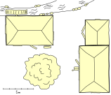
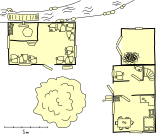
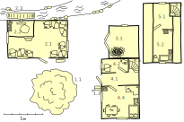
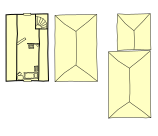

=================
Perly pro Bublana
=================

Krátké detektivní dobrodružství pro začínající hráče s pohádkovým vyzněním.

Hrdinové se zapletou s jedním velmi nešťastným vodníkem, chudým uhlířem a marnivou mlynářovou dcerou. Dokáží najít ukradené perly dřív, než se zastaví stavba nového obecního rybníka?

Zápletka pro vypravěče
======================

Vodník **Bublan** plánuje s rychtářkou **Vítkou** stavbu rybníka. Našel tři vzácné perly na zaplacení dělníků, ale ty mu v pátek večer někdo ukradl. Zlodějem je uhlíř **Jura**, který se do doupěte potopil. Jura perly dal **Máničce**, mlynářově dceři, aby na ni udělal dojem. Ta si je nechala, ale citům Jury se vysmála.

Setkání u Svitavy
=================

Dobrodružství začíná u slepého ramene řeky Svitavy u Blanska kde žije vodník Bublan.

.. admonition:: Popis pro hráče: U vodníka

   Slunce se odráží od hladiny líně tekoucí Svitavy. Na vyvrácené vrbě, jejíž větve se máčejí ve vodě, shrbeně sedí malá zelená postavička. Je to vodník. Nekouká ale po dušičkách, místo toho se nervózně tahá za velké uši a rozčileně mluví sám se sebou. Občas si srovná své tři vlasy a hlasitě si povzdechne.

Interakce s Bublanem:
Vodník je nešťastný, ale ne útočný. Pokud ho hrdinové osloví, svěří se jim:

*   **Ztráta:** Zmizely tři perly, které měl schované v hrníčku ve svém doupěti pod podemletým břehem.
*   **Pátek večer:** Musel tehdy řešit potěr, který se nerozvážně pouštěl na hlubinu místo aby zůstaval v bezpečí na mělké vodě. Zjistil, že to bylo proto že na mělčinu někdo naházel kameny (diverze zloděje).
*   **Cizí pach:** Když se vrátil do doupěte, cítil ve vodě kouř a oheň.
*   **Svědek:** Starý pstruh viděl "velkou černou postavu", jak se potápěla k doupěti. Byl to uhlíř Jára, špinavý jako každý uhlíř.

Vyšetřování v Blansku
=====================

Vyptávání ve vesnici
--------------------

Družinu možná napadne zajít na představitelkou místního práva, za rychtářkou Vítkou, a poptat se jí jestli o krádeži něco neví.

.. admonition:: Popis pro hráče: Rozhovor s rychtářkou

   "Cože? Bublan přišel o perly?" zhrozila se rychtářka. "Jo, jasně že o nich vím!" odpoví na vaše překvapené obličeje.
   Když se jí zeptáte na podrobnosti, vysvětlí vám to:
   "Už pár let tu mluvíme o stavbě obecního rybníka, ale nikdy nebylo dost peněz na zaplacení kopáčů. Pro vesnici by to byla výhra a pro vodníka taky. Vždycky mi říkal že vodník bez jezera, nebo aspoň rybníka, je jako ryba na suchu. Nedávno se mi od pána podařilo sehnat povolení a s Bublanem jsme byli domluvení že zaplatí půlku stavby, ale takhle to všechno padá. Sákryš!"
   Víc už si z ní netroufnete dolovat. Po té nepříjemné novině vypadá řádně nazlobená a odchází svižným krokem.

Kovárna mistra Janka
--------------------

Hrdinové pravděpodobně zamíří do vesnice hledat někoho, kdo smrdí kouřem. V celé vesnici nejvíc s ohněm pracuje kovář Janek.

.. admonition:: Popis pro hráče: Kovárna

   Kovárna leží mírně stranou od vesnice až kousek za mlýnem. Cestou míjíte skupinku dětí hrajících hru s tleskáním, vyhazováním a chytáním kamínků. O kus dál po cestě, tam kde je slyšet pravidelné tleskání mlýnského kola o vodu, zase na posečené louce vidíte jakousi dívku jak něco motá v rukou, snad věneček. Těsně před kovárnou vás zase na kus řeči zastaví stará babička která z lesa nese otýpku klacků. Ve vesnici se prostě stále něco děje.
   Konečně dojdete ke kovárně. Z otevřených dveří sálá žár a ozývají se pravidelné rány kladiva o kovadlinu. Mistr Janek, mohutný spocený chlap s tváří umazanou od sazí, právě vytahuje z výhně rozžhavenou podkovu.

**Interakce:**

*   Pokud ho hrdinové obviní, Janek se jen zasměje: "Já a krást perly? Já mám svoji práci! Navíc v pátek jsem byl v hospodě."
*   **Stopa:** Pokud bude mít Janek dobrou náladu, poradí že v lese pálí uhlí rodina uhlířů: "Ti jsou černí od rána do večera a kouř z nich táhne na míli daleko."

Obcházení vesnice
-----------------

Družinu může napadnou bloumat se vesnicí nebo ji obcházet a koukat a čichat kde to kouří víc než jinde. Nech si je hodit (*zkouška na INT (+ Postřeh nebo Hledání) 5*). Pokud uspějí pošli je do lesa odkud se line proužek dýmu a pokud neuspějí naveď je ke kováři z jehož komína ve vesnici stoupá nejvíc kouře.

.. admonition:: Popis pro hráče: Proužek dýmu z lesa

   Obhlídli jste snad všechny komíny ve vesnici ale všechno to jsou jen malé ohně. Nic co by vám přišlo podezřelé. V jednu chvíli ale vaše oči padnou na les na kraji údolí. Že vás to nenapadlo dřív. V kraji jsou přeci uhlíři! Často bývají špinaví od hlavy až k patě a koužem smrdí na sto honů. To by mohlo být ono!

Uhlířské milíře v lese
======================

Cesta do lesa je zarostlá a vzduch houstne štiplavým dýmem.

Pokud hrdinové v lese při hledání uhlířů zabloudí (*zkouška INT (+ Stopování)*), překvapí je dva obří pavouci. Vlastnosti pavouků viz kapitola Seznam monster.

Rodina Vorlových
----------------

.. admonition:: Popis pro hráče: U milířů

   V lese je ticho ale jak se blížíte, z menšího prostranství před vámi se ozývají různé zvuky a hlasy. Uprostřed mýtiny stojí dva velké milíře. Na několika málo místech unikají tenké proužky hustého šedého kouře. Kolem nich pobíhá několik postav, černých jako samotné uhlí. Starý Vorel právě hází lopatou hlínu na trhlinu v milíři a nadává u toho jako špaček.

**Interakce:**

*   Uhlíři jsou nevrlí a nechtějí s družinkou ztrácet čas. Jak je přimět aby se dali do řeči?
*   **Pomoc s prací:** Pokud postavy pomohou (*zkouška na SÍL 4*), Vorel si odplivne a řekne: "Jestli hledáte někoho kdo má na tyhle věci čas, běžte za naším Jurou. Má milíř o kus dál u potoka. Je to budižkničemu, pořád jenom vzdychá a čučí směrem k mlýnu." a významně mrkne na manželku která na svém černém obličeji krátce blískne zuby v chápavém úsměvu.
*   **Dar jídla:** Ulíře ale třeba taky rozmluví pokud je pozvete na svačinu. S jejich 4 dětmi si ale připravte aspoň jednu celou denní dávku jídla. Hráči jistě přijdou i na další možnosti.

.. epigraph::

   **Milíř** je velkou hranicí dřeva, která je zvenku utěsněna hlínou. V hliněném obalu je na počátku několik otvorů, aby do milíře mohl vnikat vzduch při jeho rozhořívání. Poté jsou otvory utěsněny a přísun vzduchu je regulován na velmi nízké úrovni. Milíř poté několik desítek hodin doutná za minimálního přístupu vzduchu a uvnitř probíhá za vysoké teploty karbonizace dřeva. Pak se nechá milíř vychladnout a po jeho zbourání se může vzniklé *dřevěné uhlí* vyjmout.

   -- `Wikipedia: Milíř <https://cs.wikipedia.org/wiki/Mil%C3%AD%C5%99>`_

Jurovo doupě
============

Jura má svůj milíř kousek od cesty k mlýnu.

.. admonition:: Popis pro hráče: Jurovo místo

   Mladý uhlíř Jura sedí na pařezu, v ruce drží povadlou kopretinu a nepřítomně hledí do dálky. Jeho milíř ale rozhodně nevypadá jako pečlivě opečovávané milíře které jste viděli dříve. Je malý, křivý a dým se z něj valí na mnoha místech až vás štípe v očích. V jedné díře dokonce vidíte tančit plamínky ohně. Jura vypadá, že zapomněl na celý svět a vás si ani nevšimnul.

**Interakce:**

*   Jura je ona "černá postava", zapírat ale nebude. Pokud hrdinové zmíní perly nebo vodníka, Jura se rozpláče.
*   **Přiznání:** Plačtivě: "Já nechtěl nikomu uškodit! Jenže Mánička z mlýna… ona chce jen bohaté nápadníky. Myslel jsem, že když jí dám ty perly o kterých mluvila rychtářka, bude mě mít ráda. Ale ona se mi vysmála, perly si vzala a práskla dveřmi!"

Mlýn u náhonu
=============



Konečná zastávka. Mlýn je hlídaný a Mánička se perel jen tak nevzdá.

.. admonition:: Popis pro hráče: Mlýn

   Mlýnské kolo se vesele otáčí a voda s hukotem dopadá na lopatky. Na zápraží sedí Mánička, dcera mlynáře Křišťan a jeho ženy Kateřiny. Ve slunečním světle si prohlíží něco, co se jí leskne v dlani. Na dvoře u boudy podřimuje velký huňatý pes. V zadní části dvora, za starou jabloní stojí vůz a pomocník Fabián z něj vykládá pytle s obilím a nosí je do mlýnice.

**Možné akce a interakce:**

*   **Vyjednávání:** Mánička je marnivá. Pokud postavy uspějí (*zkouška na CHAR (+ Smlouvání) 8*), mohou ji přesvědčit, aby perly vrátila (např. hrozbou vězení).
*   **Obchod:** Mánička si pravou hodnotu perel příliš neuvědomuje a tak bude ochotná (*zkouška na CHAR (+ Smlouvání) 5*) vyměnit je za šátek nebo pěknou sukni z trhu v ceně třeba 5 stříbrňáků.
*   **Nahlášení:** Co na tom že ta krádež byla klukovina? Je to zločin a basta. Juru čeká přísný trest a Máničce perly vezmou. Stačí aby postavy rychtářce nahlásili co zjistily. Pravděpodobně tím ale u místních získají nějakou nepěknou nálepku.
*   **Vloupání:** V noci je třeba se proplížit kolem psa Rafana. To bude obtížné, ale pokud se bude družinka připravovat, třeba příjde na to že Rafan miluje škvarky a ty by jim tak mohly dát velkou výhodu. Perly jsou v truhličce v prvním patře. Materiály k této vloupačce jsou níže:

Tady je jak to ve mlýně vypadá. Podkroví kde má svou komůrku Mánička a střechy k zakrytí interiérů (dokud tam hráči nevkročí) jsou v sekci "Dodatečné obrázky".



Tady je potom nápověda pro vypravěče pokud si družinka zvolí cestu nočního dobrodružství:



* 1: Dvůr mlýna obklopují tři stavby (mlýn, dům a stodola). Pro hráče bude teď ale důležité že tu hlídá pes Rafan.

  .. admonition:: Popis pro hráče: Dvůr mlýna

     Dvůr u mlýna osvětluje slabé světlo polovičního měsíce. Uprostřed stojí velká stará jabloň. Kradate se ze stínu do stínu a snažíte se nevydat ani hlásku abyste neprobudili mlynáře. Zatím je všude ticho, ale máte pocit že vás pozoruje pár číhajících očí.

  * 1.1: Rafanova bouda stojí hned vedle domu. Rafan v ní polehává a dává pozor. Povede se ho družince obejít (zkouška OBR (+ Plížení) 7)? Nebo zjistili jeho slabinu a přinesli mu pár škvarků?

    .. admonition:: Popis pro hráče: Probuzený Rafan

       Hluk který jste způsobili zapříčinil neodvratné. Pes který hlídá na dvoře se probudil a hlasitým štěkáním splnil svou povinnost. V mžiku slyšíte šramot z domu a vidíte stateného mlynáře vybíhat s vidlema v ruce. Nezbylo vám nic jiného než vzít nohy na ramena a pro dnešek to zabalit.

* 2: Mlýn

  * 2.1: Sklad. Je tu spousta pytlů s moukou a obilím, které voní sladce a lákavě. V temných koutech se možná proplíží myška, a pokud na ni šlápnete, zapíská, ale to nikoho neprobudí.

    .. admonition:: Popis pro hráče: Sklad

       Vzduch je tu těžký a hustý, plný vůně mouky a obilí. Vaše kroky se ztrácejí v měkkém prachu, který pokrývá podlahu. Mezi vysokými hromadami pytlů se mihnou stíny a ozývá se tiché šustění. Občas zaslechnete i pískání myší, které se vesele prohání po pytlích, aniž by tušily, že je právě někdo vyrušil.

  * 2.2: Mlýnice. Zde se obrovská síla vodního kola přenáší do mlýnských kamenů, které drtí obilí na jemnou mouku. Všude je spousta jemného moučného prachu, který se vznáší ve vzduchu jako kouzelný závoj. Ve dvou truhlách, které zde stojí, najdete jen složené pytle a staré tesařské náčiní, nic cenného.

    .. admonition:: Popis pro hráče: Mlýnice

       Vzduch je tu těžký a chladný, naplněný jemným pachem mouky a vlhkosti. Obrovské mlýnské kameny spí, ale zdá se, že kdykoli se mohou znovu probudit k životu. Jejich síla je cítit v každém koutě. Všude kolem se vznáší lehký moučný prach, který se třpytí ve slabém svitu měsíce, jako byste se ocitli v kouzelném snu. Kromě několika prázdných pytlů a tesařského náčiní zde není nic, co by upoutalo vaši pozornost.

* 3: Stodola

  * 3.1: Stodola. Uprostřed stodoly se tyčí obrovská kupka sena, která voní létem a sluncem. V jednom rohu tiše postává ušlechtilý kůň, jehož srst se leskne v šeru, a ve druhém spokojeně pochrupávají dva vykrmení pašíci, kteří sní o plných korytech.

    .. admonition:: Popis pro hráče: Stodola

       Vzduch ve stodole je teplý a prosycený vůní sena a hospodářských zvířat. Měkké balíky sena tvoří obrovské hromady, které lákají k odpočinku. V temném koutě klidně stojí kůň, jehož pravidelný dech je jediným zvukem, který slyšíte, kromě spokojeného pochrupávání dvou velkých pašíků, kteří se vrtí ve slámě. Zdá se, že zde vládne klid a mír, přerušený jen tichými zvuky spících zvířat.

* 4: Dům, přízemí

  * 4.1: Vstupní chodba. Malá, úzká chodba, ze které vedou dvoje dveře – jedny doprava a druhé doleva. Přímo před vámi se pak vine dřevěné schodiště do patra. Kam se vydají?

    .. admonition:: Popis pro hráče: Vstupní chodba

       Ocitáte se v úzké, temné chodbě. Před vámi se tyčí dřevěné schody, které mizí kdesi v temnotě nahoře. Na každé straně chodby vidíte jedny zavřené dveře. Jejich dřevo je staré a nese stopy mnoha let používání. Z kterých dveří se ozývá tiché oddechování spících obyvatel, a co se skrývá za těmi druhými? A co nahoře? Je tam Mánička, nebo snad něco jiného?

  * 4.2: Spíž. Malá, chladná místnost plná zásob. Na zemi leží pár pytlů s bramborami a jablky, z košů vykukují kořenová zelenina a bylinky. Ze stropu, na silném provaze, visí velký kus uzeného špeku, jehož vůně dráždí smysly.

    .. admonition:: Popis pro hráče: Spíž

       Dveře se s tichým zavrzáním otevřely do chladné spíže, kde se mísí vůně sušených bylinek, kořenové zeleniny a uzeného masa. Na policích jsou úhledně srovnány zavařeniny a sušené ovoce. Ze stropu visí velký, lesklý kus špeku, který láká k zakousnutí. Vše je tu pečlivě uskladněno, připraveno na dlouhou zimu. Nic, co by se zdálo být neobvyklé.

  * 4.3: Schody nahoru. Dřevěné schodiště vede do horního patra. Pátý schod, jak už to tak bývá u starých mlýnů, vrzne při sebemenším dotyku. Podaří se jim projít nahoru, aniž by tento zrádný schod zavrzal a vzbudil mlynáře? (*zkouška OBR (+ Plížení) 2*)

    .. admonition:: Popis pro hráče: Schody

       Staré dřevěné schody se vinou vzhůru do tmy. Každý krok musí být pečlivě zvážen, neboť dřevo tu a tam tiše zasténá pod vaší vahou. Někde uprostřed schodiště cítíte, že se jeden ze schodů chvěje a hrozí, že zradí vaši tajnou misi. Budete dostatečně obratní a tiší, abyste se vyhnuli vrzání, které by mohlo probudit spící dům?

  * 4.4: Hlavní světnice. Srdce domu, kde dominuje velká pec, která sálá zbytkovým teplem. Uprostřed stojí bytelný stůl obklopený dřevěnými židlemi, a v rohu se krčí velká manželská postel, na níž tiše spí mlynář s mlynářkou, objímající se ve sladkém spánku. Probudí se, pokud do světnice vstoupí? (*zkouška OBR (+ Plížení) 4*) Pokud začnou otevírat truhly (ve kterých je stejně jen nádobí a nějaké oblečení), velmi pravděpodobně spící probudí (*zkouška OBR (+ Plížení) 6*).

    .. admonition:: Popis pro hráče: Hlavní světnice

       Tichý pokoj, jehož dominantou je velká, hřejivá pec, která ještě vydává slabé teplo. Uprostřed stojí těžký dřevěný stůl, na němž jsou patrné stopy nedávné večeře. V rohu místnosti, pod měkkou peřinou, spí mlynář s mlynářkou, jejich dech je klidný a hluboký. Vypadá to, že jsou ponořeni do sladkých snů. Pohybuje se tu velmi opatrně, abyste nenarušili jejich klid a neprobudili hrozivého mlynáře. I to nejmenší zavrzání podlahy by mohlo zmařit celou vaši misi.

* 5: Dům, podkroví

  * 5.1: Chodba. Krátká, úzká chodba, která vede k Mániččinu pokoji. Nic zajímavého se zde nenachází, jen tma a staré dřevěné obložení.

    .. admonition:: Popis pro hráče: Chodba v podkroví

       Nahoře vás přivítá tichá, tmavá chodba. Stěny jsou obložené starým dřevem a vzduch je zatuchlý. Nikde nic, co by vás zaujalo nebo co by stálo za pozornost. Jen tma a ticho před hlavním cílem vaší cesty.

  * 5.2: Mániččin pokoj. Sladce vonící pokojíček, jehož dominantou je postel s nebesy, kde pod měkkou peřinou spí Mánička a sní své marnivé sny. Vedle postele stojí toaletní stolek plný líčidel a voňavek. V pokoji jsou dvě truhly. Probudi se Mánička, když vejdou do pokoje? (*zkouška OBR (+ Plížení) 4*) V truhličce u dveří najdete jen pečlivě složené šaty a spodničky, ale v truhličce u postele, pečlivě ukryté pod hromadou voňavých stužek a krajek, leží její poklady – a mezi nimi i ty lesklé perly, schované v malém sametovém pytlíku.

    .. admonition:: Popis pro hráče: Mániččin pokoj

       Před vámi se otevírá pokojíček, který voní po květinách a něžných parfémech. Uprostřed místnosti stojí elegantní postel s nebesy, ve které spí Mánička, její dech je klidný a tichý. Vedle postele je malý stolek, na němž se lesknou flakónky s voňavkami, líčidla a spousta zrcátek. V rohu stojí dvě dřevěné truhly, jedna menší a jedna větší. Která z nich skrývá Mániččino tajemství, po kterém toužíte? A dokážete se k ní dostat, aniž byste probudili spící krásku?

Závěr
=====

*   **Úspěch:** Bublan hrdinům poděkuje a daruje jim **Vodní kámen** (umožní zadržet dech pod vodou na 10 minut). Rychtářka je pozve na hostinu.
*   **Neúspěch:** Rybník se nepostaví, Bublan zklamaně odejde ze Svitavy někam jinam a Mánička si za perly ve městě koupí drahé šaty, ve kterých bude vypadat ještě pyšněji.

Seznam monster
==============

Obří pavouci v lese
-------------------

Pokud hrdinové v lese při hledání uhlířů zabloudili, vyskočili na ně dva poplašení obří pavouci.

```tools/doit.py --data data/ format --entity Beast:pokoutnik_lesni --template tools/templates/beast.rst```

Hlídací pes Rafan
-----------------

Pokud Rafan útočí, začne štěkat. Pokud ho postavy neumlčí do 2 kol, probudí se mlynář.

```tools/doit.py --data data/ format --entity Beast:pes --template tools/templates/beast.rst```

Seznam postav
=============

* Vodník Bublan - zadává úkol, poskytuje počáteční indicie a případně odměňuje.
* Kovář Janek - možný první podezřelý, ale o případu nic neví.
* Rychtářka Vítka - může družince vysvětlid dohodu s Bublanem, ale o případu nic neví.
* Uhlíři Ješek, Slavomíra a jejich děti - můžou družinku nasměrovat na Juru.
* Uhlíř Jura - zamilovaný zloděj perel.
* Mlynářovic dcera Mánička - dostala perly od Jury, ale jeho lásku neopětuje.

Dodatečné obrázky
=================



