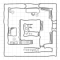
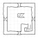
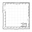

===================
Opuštěná mágova věž
===================

Dobrodružství je zamýšleno pro skupinku 3 dobrodruhů na první úrovni. Co se pravidel týče a způsobu popisu příšer či předmětů, vycházíme z prastarého Dračího doupěte. Myslím ale, že to půjde převést na libovolný systém.

Odstavečky uvozené textem "Popis pro hráče:" je bezpečné hráčům přímo přečíst. Zbytek slouží jen potřebám vypravěče. Popisy pro hráče neobsahují přesný popis tvaru místnosti a toho jaké dveře z ní vedou - předpokládá se, že to doplní vypravěč vlastními slovy podle přiložených mapek.

Jakožto vypravěč si text předem prolítni ať víš do čeho jdete a pak můžete začít hrát.

Shrnutí
=======

Ve venkovské části království, uprostřed přívětivé zemědělské krajiny stojí ničím nezajímavé městečko. Nedaleko od městské palisády obklopující město stojí opuštěná bachratá věž. To je středobod tohoto příběhu.

Před více než půlstoletím občas ve věži na letním bytě pobýval mocný mág či alchymista. Věnoval se tady svým zálibám jako sestavování herbáře a pozorování hvězd. Jednoho dne však náhle odešel a už se nevrátil, což položilo základ spoustě fantastických teorií (například: *uvízl v pekle když se pokusil získat žezlo pána temnot*, *zemřel když před nájemnými vrahy chránil krále* nebo *ze všech těch knih se zbláznil a do teď žije v horách v malé jeskyni jako poustevník*) které se zakořenily v étosu přilehlého města.

Krátce po jeho odchodu věž jednou navštívili vykradači a odnesli si odtamtud slušné bohatství, ale také mnoho strašidelných historek a vážných šrámů. Od té doby už se do věže nikdo neodvážil a ta tam jen stojí a chátrá.

Pekař Žemlička je první který si dovolil uvažovat o překonání strachu a praktickém využití věže. Chce v ní na hubené roky uskladňovat obilí, které by levně nakoupil vždy když je dobrá cena. O tom plánu se ale dozvěděl jeho konkurent, pekař Preclík, a do věže vyslal dva své pacholky. Mají za úkol tam občas v noci dělat randál a svítit v oknech, aby to vypadalo že ve věži straší a Žemličku od jeho nápadu odradili.

Pacholci z toho úkolu dvakrát nadšení nebyli - komu by se po setmění do té věže chtělo, že? Ale posilnění alkoholem se svého úkolu neochotně zhostili. Ve věži se ujistili že ze sklepa se nahoru nic nedostane (zatloukli dveře) a že dveře z horního patra jsou bytelné a pevně zavřené. Když se včera v prvním patře dočasně ubytovaly poletuchy, jedno takové "strašení" pozorovaly.

Pokud družinka dorazí to věže pozdě večer, pravděpodobně tam na pacholky narazí. Budou opilí a před družinkou se pokusí vyděšeně utéct. V jinou dobu bude věž prázdná.

Věžním sklepem protéká stoka městské kanalizace. Přes mohutnou mříž však projdou krysy a ty si v jedné místnosti sklepení udělaly doupě. Ve spižírně nad schody ze sklepa se zase ubytovaly ploštice zelené, které jako drobotinu ve sklepě vyplavila stoka. O boj tedy nouze nebude.

V prvním patře družinka narazí na zmíněné poletuchy a možná najde tajnou místnost za gobelínem. Na tomto podlaží čaroděj žil a pracoval.

V dalším patře pak už je prázdno, jen rozbitý hvězdářský dalekohled a schody na plochou střechu se zbytky zábradlí prozrazují další vášeň dávného čaroděje.

Teď už ale hurá do dobrodružství.

Zadání úkolu
============

Družinka prochází trhem na malém městě. Zrovna se přehrabuje nabídkou jakéhosi stánku, když se k nim přitočí jeden vážený měšťan. Bude jim chvíli "mazat med kolem huby", a pak je požádá o laskavost.

.. admonition:: Popis pro hráče:

   Na trhu k vám přistoupí cizí muž. Na hlavě má bílý baret, moukou zaprášenou kostkovanou košili a přes větší břicho bílou zástěru.

   Nesměle vás osloví: "Jmenuji se Žemlička, jsem tady radním a pekařem. Vypadáte jako zkušení dobrodruhové, tak jsem vás oslovil. Měl bych pro vás jistou prácičku."

   Vybídnete ho ať pokračuje: "Za městem stojí stará opuštěná věž. Jistě jste si jí všimli, nedá se přehlédnout. Rád bych ji využil jako sklad obilí. Skladiště ve městě jsou strašně drahá. Lidi ale blekotají něco o tom že tam straší." Chvilku se odmlčel a se sklopenými zraky rychle dodal: "Já ale samozřejmě myslím že to je nesmysl. Pro někoho jako vy", poplácá jednoho z vás po silném rameni, "to nebude nejmenší problém. Pomůžete mi?"

   Nějaké peníze by se vám hodily a on nabízí 30 zlatých. Doptáte se na podrobnosti a pochopíte že prostě potřebuje abyste se do věže podívali a ujistili se že tam nestraší - případně to strašidlo vyhnali nebo, nó, zlikvidovali.

**Akce**

* Družinka se může pokusit usmlouvat výši odměny. Protože se jedná z zkušeného obchodníka, jde o past na *CHAR 2/9, cena se sníží na 25 zlatých/30 zlatých/40 zlatých*.
* Pokud se družinka pokusí na věž vyptávat jiných obyvatel města, možná se dozví:

  .. admonition:: Popis pro hráče:

     "To je věž ve které před dávnými věky bydlel jeden mocný čaroděj.", řekl stařeček."Jednoho dne se ztratil a už se nikdy neobjevil. Prý je zakletá, ale já tomu samozřejmě nevěřím!", rychlý nervózní pohled ve směru kde věž stojí ale svědčí o opaku.

  .. admonition:: Popis pro hráče:

     "No být váma, tam bych rozhodně nechodila. Strašilo tam už když jsem byla malá a teď se to prý ještě zhoršilo. Lidi tam prý viděli zářící duchy a slyšeli pekelný rejdy."

  .. admonition:: Popis pro hráče:

     "Já bych řekla, že ty řeči o strašení jsou nesmysl. To jen nás naše mámy tak dlouho tou věží strašili, že tu už nikdo neví co je vlastně pravda. Když se tam potom nějakej opilec zatoulá, klidně uvidí i ďábla jak tancuje na střeše jestli víte jak to myslím, hahaha."

* …a podobně.

U věže
======

V jednu chvíli se družinka jistě dostane k tomu, aby věž prozkoumala. Popsat by se dala takto:

.. admonition:: Popis pro hráče:

   Kamenná čtvercová věž stojí na rovince, asi sto metrů od městských hradeb. Tři patra z velkých kamenných bloků se zvedají vysoko nad malou městskou palisádu a v rovné krajině poseté poli, sady a pastvinami na sebe zlověstně stahují pozornost. Obklopená je houštinou křoví a mladých stromků, které jsou oblíbenými odpočívadli černých havranů. Jediné dveře jsou zavřené a vypadají funkčně, otvory těch několika malých oken v přízemí jsou zahrazené deskami.

Přízemí
=======

.. image:: img/opustena_magova_vez_0.svg
   :alt: Přízemí
   :align: center

① Strážnice
-----------

Tady asi hlídala někdejší posádka, čarodějovi sloužící. Pacholci pekaře Preclíka to tu už řádně probrali - je to jedna z místností kam jim strach dovolil vstoupit.

.. admonition:: Popis pro hráče:

   Tři rozbité postele se slamníky prolezlými plísní, trosky kamínek, stolu a tří židlí. Takhle na první pohled nic zvláštního.

**Akce**

* Pod jednou z postelí se najdou trosky truhličky, prázdné. Ta není nijak schovaná. Najdou ji pokud aspoň trošku hledají a na to není potřeba házet.
* Pokud zbytky truhličky někdo zkoumá, tak past na *INT 3, nic/všimne si že byla rozbita teprve nedávno*.

② Audienční místnost
--------------------

Čaroděj si asi potrpěl na osobní auru a žadatele přijímal v této jistě krásné místnosti sedě na trůně jako král.

.. admonition:: Popis pro hráče:

   Tato místnost asi měla zapůsobit na přijivší žadatele. Půlkruhové vyvýšené pódium se třemi schody, na kterém stojí sice zaprášené, ale krásné a zjevně pohodlné křeslo je přímo proti vstupu. Podél stěn občas vidíte trosky polic a jiné harampádí.

**Akce**

* Pokud se někdo pokusí na křeslo posadit, z opěradel vyskočí bodce a zaryjí se odvážlivci do stehen, jen málokomu se podaří ucuknout. Past na *OBR 8, zranění za 1-3 životy/vyhnutí se bodcům*. Kdysi byl asi na bodcích jed což z nich dělalo smrtelné nebezpečí. Teď jsou už "jen" nebezpečné. Past se dá deaktivovat tlačítkem na područce křesla.
* Pokud se někdo pokusí nalézt vypínač pasti, tak se jedná o past *INT 9, nic/nalezen čudlík v čele pravé područky*. Jeho stisknutí umožní si do křesla bezpečně sednout.

③ Vykradená spižírna
--------------------

Naši nezvaní hosté si dali práci s tím, aby se nic nedostalo ze sklepa sem a pak taky na tom aby se odtud nedostalo nic do hlavní (audienční) síně. O žádnou pečlivou práci ale nešlo. Asi dost spěchali.

.. admonition:: Popis pro hráče:

   Dveře do této místnosti jsou zatlučené, jen se hemží hřebíky a hala bala přitlučenými deskami.

Pokud se družinka dostane dovnitř:

.. admonition:: Popis pro hráče:

   V místnosti, asi to byl nějaký sklad nebo spižírna, je jen dvojice prázdných polic a schody vedoucí do nižšího patra. Ty jsou zaházené zbytky trámů, desek a podobně. Počkat, nepohlo se něco támhle pod policí?

**Akce**

* Vyražení nebo vypáčení dveří, aby se družina vůbec dostala do místnosti je past *SÍL 3/5, zranění hřebíkem za 1 život/dveře vydržely/dveře povolily*.
* Pokud se družina dostane dovnitř, zaútočí na ně *2 Ploštice zelené (životy ▢▢▢ a ▢▢, ÚČ: +1 (kusadla) + ochromení, OČ: +3, zkušenosti: 5)*.
* Pokud se družina rozhodne vyčistit schody aby se tamtudy dalo projít do sklepa (a má lucernu aby si posvítila na práci), asi se nic extra nestane, jen to bude trvat třeba aspoň půlhodinu.

④ Záchod
--------

Doporučuji popsat neurčitě, ať si na to hráči přijdou sami. Otvor vede do stoky v nižším patře. V místnůstce je jediné, nezatarasené, okno - pravděpodobně kvůli větrání. Né že by to ale pomáhalo.

.. admonition:: Popis pro hráče:

   Dost to tu páchne i když okénko není ničím zatarasené. Na konci této slepé chodbičky je něco jako velká dřevěná truhla s okrouhlým otvorem v její horní části. K čemu to asi sloužilo?

⑤ Okno
------

V tomto okně Preclíkovi pohůnci svítí nejčastěji, protože je otočeno k městu a "strašení" tak vidí nejvíc lidí.

.. admonition:: Popis pro hráče:

   Z půli zatlučené okno. Na parapetu leží začouzená lucerna s trochou oleje.

Sklep
=====

.. image:: img/opustena_magova_vez_-1.svg
   :alt: Sklep
   :align: center

① Krysí hnízdo
--------------

Tady mají krysy klid. Mřížemi z městské stoky je sem nikdo pronásledovat nemůže a tak si tu shromažďují svoje poklady.

.. admonition:: Popis pro hráče:

   Podlaha místnosti je plná větviček, hadrů a malých kostí. Nemáte ale čas si ji prohlížet, protože s podrážděným pištěním se na vás vrhnou krysí obyvatelé této části sklepení.

**Akce**

* Dřív než cokoli jiného si družina musí poradit s:

  * *3 Krysy obří (životy ▢▢▢▢▢, ▢▢▢  a ▢▢▢, ÚČ: +2, OČ: +1, zkušenosti: 5)*
  * *3 Krysy obyčejné (životy ▢▢, ▢▢ a ▢, ÚČ: 0, OČ: 0, zkušenosti: 1)*

* Prohrabovat se v tom nepořádku je koledování si o otravu krve, takže je to past na *ODO 2/4, otrava/nic/nalezení krysího pokladu*. Pokud se prohledávající postava otráví, zasažené místo opuchne a zezelená, postava ztratí 1 život první den, 2 životy druhý den a 3 životy každý další den dokud nepodstoupí nějaký druh léčení (ať už u léčitele, nějaké vědmy nebo aspoň nevypije nějaké léčivý lektvar). V pokladu se najdou 2 prsteny a jedna náušnice (za 50, 80 a 40 zlatých).

② Díra ve stropě
----------------

Ano, toto je ta díra ze záchodu. Pod ní protéká stoka. Nepředpokládám že se sem někdo dostane, protože to znamená brodění se stokou.

③ Mostek
--------

Dřív tu asi býval mostek, ten už je ale dávno pryč a jedinou možnou cestu na druhou stranu představuje jakési naplavené dřevo.

.. admonition:: Popis pro hráče:

   Přes dva metry širokou stoku tu kromě drobného harampádí leží naplavený kmen. Vypadá kluzce, ale přejít po něm snad půjde.

**Akce**

* Přejít přes kmen je past na *OBR 3, pád do stoky/přejití*. Pokud postava spadne do stoky, stupeň charisma klesne o 4 dokud se někde pořádně neumyje.

④ Starý sklad
-------------

Nic zajímavého, ale nenechavé družině jistě zabere nějaký čas tuto místnost prohledat.

.. admonition:: Popis pro hráče:

   Na první pohled tu není nic zajímavého, na zemi jen zbytky dřeva a prach.

První patro
===========

① Pracovna
----------

Dříve luxusní pracovna se spoustou skříní plných knih byla pravděpodobně vyhlášená a tak se stalo, že vykradena byla již brzo po zmizení původního majitele.

.. admonition:: Popis pro hráče:

   U stěn stojí staré prázdné zaprášené police, všechny prázdné. Pod velkým oknem rozpadlý stůl zničený deštěm a sněhem z již nechráněného okna.

② Truhlice
----------

Pravděpodobně unikla pozornosti dávných vykradačů, protože obsahovala hlavně bezcenné šaty. Tedy než se o ně postaraly myši a moli.

.. admonition:: Popis pro hráče:

   Okovaná truhlice s dávno uraženým zámkem.

**Akce**

* Po otevření:

  .. admonition:: Popis pro hráče:

     Po otevření z truhlice vyběhnou tři myši. Truhla obsahuje nevábně vypadající a ještě nevábněji vonící směs zbytků látek a všemožných myších produktů.

* Pokud se někdo rozhodne prohrabat zbytky látek rozežrané myšmi a moli, pravděpodobně něco najde: past na *INT 4, nic/nalezen Lektvar Rudého kříže*. Alchymista ho jistě pozná, ale pro toho kdo s ním zatím do styku nepřišel:

  .. admonition:: Popis pro hráče:

     Lahvička s temně rudou kapalinou. Malinovka to rozhodně nebude.

③ Ložnice s krbem
-------------------

Jistě byla krásná a pohodlná.

.. admonition:: Popis pro hráče:

   Velká a dříve jistě pohodlná postel s nebesy, naproti ní na stěně zbytky velkého a dříve asi i barevného gobelínu a na konci místnosti velký krb.

**Akce**

* V posteli vyspávali 3 malí tvorečci kteří družinu už nějaký čas pozorovali. Ten rámus který družina dělá by totiž vzbudil i mrtvého. Jsou to *Poletuchy (životy ▢▢▢, ▢▢▢ a ▢, ÚČ: +1, OČ: +3, zkušenosti: 5)*

  * Pokud se s nimi někdo dá do řeči, celkem ochotně si povídají.
  * Do města přiletěli z nedaleké vesnice, protože doprovázely jednoho sedláka na trh. Chtěly mu nenápadně zajistit dobrý obchod protože jim doma s čímsi pomohl.
  * Po skončení trhu se vracejí domů, ale chtěly se někde prospat a tak vletěly do opuštěné věže a měly štěstí na pohodlnou a prázdnou postel.
  * Pokud na to někdo zavede řeč, rády prozradí že včera večer bylo ve spodním patře rušno. Byli tam jacísi dva lidé, kteří tam u okna mávali lucernami a houkali a zjevně si dodávali odvahy nějakou pálenkou. To tyto sestry nemají rády, tak se před nimi raději schovaly.
  * Pokud na ně skupina dobře zapůsobí, možná jim naznačí přítomnost tajných dveří (první rým) a možná i pasti v místnosti za nimi (druhý rým):

    | Když se dobře rozhlédneš,
    | další dveře nalezneš.
    | Vevnitř ale pozor dej,
    | na jednu barvu nešlapej.

④ Tajná místnost
----------------

Pravděpodobně kouzelníkova skrýš pro cenné věci. Před odchodem tam ale asi nechal jen nějaké drobky, které ale pro začínající dobrodruhy budou slušným pokladem.

.. admonition:: Popis pro hráče (pokud objevili tajné dveře):

   Po otevření dveří se po stěnách i po zajímavé černo/bíle kostkované podlaze rozeběhla pěkná řádka (normálních) pavouků. Tato místnost už světlo neviděla dlouhé desetiletí. Na jejím konci stojí truhla.

**Akce**

* Nalezení dveří do tajné místnosti je past na *INT 7, nic/objevení dveří*.

  .. admonition:: Popis pro hráče:

     Při průzkumu stěny sis všiml(a) spáry ve stěně. Při dalším ohmatávání stěny způsobilo zatlačeni na jeden kámen jakési "cvak" a pootevřely se skryté dveře do malé místnůstky.

* Pokud někdo prohledá stěny a hlavně podlahu (aniž by na ni vstoupil), možná si všimne pasti: *INT 6, nic/nalezení pasti*. Past funguje tak, že pokud někdo stoupne na černou kachli, z otvorů ve stěně vyletí salva šipek aby narušitele zasáhla.
* Pokud někdo stoupne na černou kachličku, šance vyhnout se šipce je past na *OBR 8, zranění za 1 - 4 životy/vyhnutí se šipkám*.
* Pokud postava ví jak to s touto nášlapnou pastí funguje a pokusí se přejít jen po bílých kachličkách, je to past na *OBR 2, přešlápnutí na černou kachličku/přejití bez problémů*.
* Ten kdo to umí, může v truhle na konci místnosti vycítit magenergii. Je v ní 20 magů jako jakési poplašné zařízení. Slouží k tomu aby vyslala mentální "budík" do mysli dávného majitele pokud ji otevře někdo jiný než on sám. Vzhledem k tomu že čaroděj je po smrti, při otevření jen s zapraskáním jako od statické elektřiny vyprchá a v příběhu nehraje roli. Družinku to ale možná znejistí.
* V truhle je:

  * měšec s 55 zlatými
  * lektvar Megacloumák - alchymista by ho jistě poznal, ale pokud v družince alchymista není a nikdy se s ním nesetkali, můžeš použít tento popis:

    .. admonition:: Popis pro hráče:

       Lahvička se skleněným špuntem po okrajích zalitých voskem. kapalina je průhledná, zbarvená do světle žluta.

  * lektvar Rudého kříže

    .. admonition:: Popis pro hráče:

       Lahvička s temně rudou kapalinou.

  * svitek Ochrana před nemrtvými. Alchymisté svitky poznávají podle pečetě jejímž rozlomením se svitek aktivuje, tento má však navíc na sobě "nápovědu" v obecné řeči:

    .. admonition:: Popis pro hráče:

       List papíru smotaný do ruličky zajištěný pečetí s nějakým složitým alchymistickým znakem který vám nic nepřipomíná. V rohu ale navíc vidíte uhlem psanou poznámku "ochrana před nemrtvými".

Druhé patro
===========

Tady si čaroděj skladoval svůj dalekohled na pozorování hvězd. Zbyla z něj ale jen hromádka nepořádku.

.. admonition:: Popis pro hráče:

   Vlhká místnost se čtyřmi okny, ze které v jednom rohu vedou nahoru jen jedny příkré schody. V dalším rohu vidíte trosky nějakého přístroje. Jsou tam zbytky dřevěných nožek, pomačkané plechová trubka a skleněné střepy.

Střecha
=======

Na střeše nic zajímavého není, snad až na rozhled.

.. admonition:: Popis pro hráče:

   Toto je rovná střecha věže. Je z ní krásný výhled do okolí a na město. Ve spárech mezi kameny roste mech a ve větru se třepetají listy několika semenáčků břízy. Zábradlí je na několika místech zničené, takže pozor. Pád dolů by byl dlouhý a asi smrtelný.

Hlášení úspěchu
===============

Pokud družinka zjistí jak to s tím strašením ve věži bylo, pravděpodobně vyhledají pekaře Žemličku aby si vyzvedli odměnu 30 zlatých (nebo jinak jestli se domluvili na jiné částce, pekař drží slovo).

Pokud družinka předvede opravdu strhující líčení toho jaké hrůzy a nebezpečenství (mimo těch dvou pohůnků) ve věži vyčíhalo, jistě ještě něco přidá.
